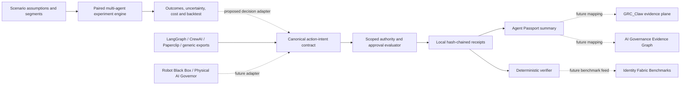

# A2Z Agent Trust Fabric

[](https://github.com/AAH20/agent-trust-fabric/actions/workflows/verify.yml)

**An inspectable agent-simulation and trust reference stack.** It combines a reproducible, paired-intervention scenario engine with a framework-neutral authority and local evidence kernel. The simulation engine explores possible outcomes and tradeoffs; the trust kernel evaluates exported action intents from LangGraph, CrewAI, Paperclip, or another runtime against scoped authority and emits a tamper-evident local receipt chain.

This repository does **not** execute tools, connect to production agents, authenticate principals, certify compliance, forecast real outcomes, or prove an external event really occurred. Source names in the fixture identify illustrative event producers; live SDK and webhook integrations remain future work. The trust output status is deliberately `INTEGRITY_ONLY_NOT_AUTHENTICATED`.

## Run a scenario experiment

```bash
python3 -m agent_trust_fabric.cli simulate fixtures/support-rollout-scenario.json --output /tmp/support-simulation.json
```

The synthetic support-rollout case models 240 heterogeneous users on a small-world social graph over 12 steps and 40 runs. It compares a quality investment and discount campaign against the baseline with shared random draws. The result reports adoption, resolved requests, net value in **model units**, run quantiles, and paired effects. The scenario digest and seed make the experiment replayable. An optional observed-outcome input computes baseline MAE against a naive comparator; only genuine held-out observations can support predictive claims. See the [engine design and benchmark plan](docs/SCENARIO_ENGINE.md) and [scenario contract](schemas/scenario.schema.json).

## Run the four-event demo

Python 3.11+ is sufficient; the runtime has no third-party dependencies.

```bash
python3 -m agent_trust_fabric.cli run fixtures/refund-agent.json --output /tmp/agent-passport.json
python3 -m agent_trust_fabric.cli verify /tmp/agent-passport.json --case fixtures/refund-agent.json
python3 -m agent_trust_fabric.cli benchmark fixtures/refund-agent.json
python3 -m agent_trust_fabric.cli run fixtures/refund-agent.json --format markdown --output /tmp/agent-passport.md
python3 -m agent_trust_fabric.cli run fixtures/refund-agent.json --format html --output /tmp/agent-passport.html
python3 -m unittest discover -s tests -v
```

The synthetic refund agent has four events: one authorized refund, an action after its authority expires, a read outside its customer boundary, and a replayed approval. The expected decisions are `allow, deny, deny, deny`. Each receipt stores an input digest, explicit decision reasons, and the previous receipt digest. The verifier checks the chain and replays the original case. An attacker who controls both the case and bundle can regenerate a consistent chain; production evidence needs a separately trusted signer, durable storage, and authenticated source.

An offline [HTML Agent Passport](demo/refund-agent-passport.html) is included for review. It is regenerated from the same fixture and clearly labels the evidence as a local reference case.

## Architecture



The portable contract records the agent and run IDs, source, action, resource, time, scoped delegation, optional amount, approval assertion, and reported cost. `refund.issue`, `access.grant`, and `physical.act` require a scoped one-time approval in this reference policy. A denied event is still recorded. No tool is invoked by this package.

The intended division of responsibility is precise:

| Component | Existing capability | Trust Fabric role |
| --- | --- | --- |
| [GRC_Claw](https://github.com/AAH20/GRC_Claw) | Policy and evidence control plane | Future receipt/passport export target; no live bridge in v0.1 |
| [AI Governance Evidence Graph](https://github.com/AAH20/ai-governance-evidence-graph) | Assurance-case compiler | Future top-level claims about agent deployments |
| [Identity Fabric Benchmarks](https://github.com/AAH20/identity-fabric-benchmarks) | Adversarial identity tests | Future portable conformance suite |
| [AgentMesh Gateway](https://github.com/AAH20/ai-agent-runtime-gateway) | Execution planning | Future enforced runtime authority check |
| [Physical AI Governor](https://github.com/AAH20/physical-ai-governor) | Synthetic physical-AI safety testbed | Future action-intent producer, never certification by itself |

## Contract and threat boundary

The [event schema](schemas/action-intent.schema.json) is the published minimum for this reference kernel. Validity is checked in code before evaluation. A malformed event fails rather than receiving an allow decision. Authority must match the agent and run, list the action, cover the resource prefix, and remain unexpired. Sensitive actions also need a matching, unexpired approval ID that has not already been consumed in the case.

This is **not a production policy decision point**. Timestamps and identities are caller asserted, prefix matching is a restricted demo policy, event order is bundle order, there is no durable replay store, and SHA-256 chaining gives local tamper evidence rather than source authenticity. Do not place it in a safety-critical control loop or rely on it for legal or regulatory conclusions.

## Product path

The public project now has two complementary kernels: an inspectable scenario engine for decisions and a reference authority/evidence kernel for actions. [LangGraph](https://docs.langchain.com/oss/python/langgraph/overview) can own durable execution; [CrewAI](https://github.com/crewAIInc/crewAI) and [Paperclip](https://github.com/PaperclipAI/paperclip) can own their agent and organization workflows. A2Z adds reproducible counterfactual experiments, authority checks, observable outcomes, and independently inspectable evidence across them. [MiroFish](https://github.com/666ghj/MiroFish) is a comparison target for future external benchmarks. This repository does not incorporate its AGPL-3.0 code or claim superior predictive performance.

The [commercialization and rollout plan](docs/PRODUCT_PLAN.md) defines the proposed open-source/commercial boundary, a Chatbase-like customer-agent wedge, acceptance gates, and unit-economics instrumentation. The [integration gates](docs/INTEGRATIONS_AND_RELEASE_GATES.md) spell out how LangGraph, CrewAI, Paperclip, LangSmith, and simulation systems become supported without treating a passive trace as runtime enforcement. These are plans and targets, not claims of deployed adoption or revenue.

## License

MIT for this repository. Upstream projects retain their own licenses and trademarks. In particular, do not copy MiroFish AGPL-3.0 code into this MIT package without a separate licensing review.
