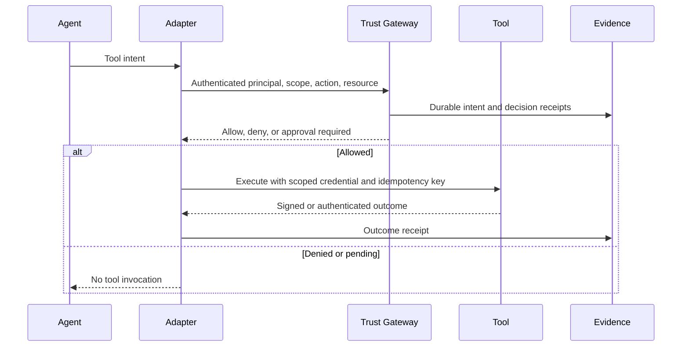

# Integration contracts and release gates

The v0.1 executable supports only exported JSON cases. Framework labels in its fixture are not proof that an upstream library emitted those events. A connector may move from planned to supported only after it passes the gates below against a pinned upstream release.

## Framework responsibilities

| Upstream | Observe | Trust Fabric owns | Must not infer |
| --- | --- | --- | --- |
| LangChain / LangGraph | Thread/run identifiers, tool intents, retrieval references, checkpoints, human interruption and resume | Map to action-intent, call authenticated policy service before sensitive tools, correlate outcome receipts | That a checkpoint proves action success or external authorization |
| LangSmith | Traces, offline/online evaluations, run metadata | Export hashed references and import evaluation outcomes if customer opts in | That LangSmith is required for local verification |
| CrewAI | Crew/task/agent identity, tool calls, task result | Bind delegated scope to each agent/tool execution | That a role description is a credential |
| Paperclip | Organization, agent, goal, budget, approvals | Bind company/tenant and approved budget to runtime action | That an org chart alone enforces authority |
| MiroFish | Scenario inputs, simulation version, seeds, output distributions | Label as simulation evidence and compare against observed outcomes | That a simulation accurately predicts a person or authorizes action |
| Customer-agent channels | Conversation ID, cited source IDs, requested business action, actual system outcome | Tenant-scoped retrieval, policy check, approval, receipt, cost ledger | That an answer was grounded simply because it cites a document |

## Required event path for a real connector

The real gate must sit **before** side effects. A passive trace importer can observe and evaluate but cannot claim prevention.

## Connector release gates

1. **Identity:** workload identity is authenticated, tenant-bound, and separate from the model-supplied agent name.
2. **Authority:** action and resource checks occur before tool invocation; approval is bound to principal, run, tool, resource, amount, expiry, and one-use nonce.
3. **Revocation:** repeated and delayed calls cannot use a revoked grant beyond the documented deadline.
4. **Evidence:** every allow, deny, pending approval, actual execution, failure, and retry has an independently verifiable receipt. No secrets or raw private prompts appear in exports.
5. **Recovery:** replay after process death cannot duplicate a refund or silently lose an approval decision.
6. **Evaluation:** pinned fixture pack includes cross-tenant retrieval, scope escalation, stale authority, approval replay, prompt injection, missing outcome, and denied-tool invocation attempts.
7. **Compatibility:** upstream version and contract tests are public; breaking changes fail CI and trigger a support-window decision.

## Commercial readiness gate

A connector can be billed as managed only after operational proof: authenticated ingestion, durable storage and backup restore, tenant isolation, admin audit, incident response procedure, support ownership, measured cost per accepted outcome, and explicit service-level objective. A passing synthetic test does not satisfy this gate.

## First customer-facing agent

Use a refund-support case because a buyer can understand both the legitimate outcome and the failure. For each request, evaluate retrieval ACL correctness, grounded answer rate, approval coverage, duplicate refund rate, verified final payment status, p95 latency, human escalation rate, and total variable cost per accepted resolution. Collect production feedback only with tenant permission and data-minimization controls. Voice and omnichannel delivery can follow the same action contract after the web workflow passes its gates.
