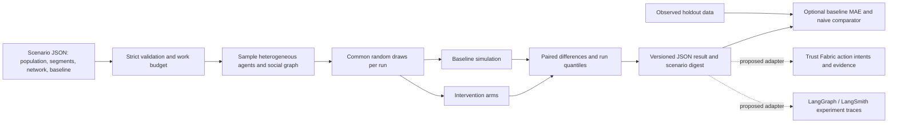

# Scenario engine: executable baseline and evidence path

This repository now contains a simulation engine in addition to the authority/evidence kernel. It is a **synthetic decision laboratory**, not a predictor of real markets or a replacement for human judgment. The first vertical models adoption and service outcomes during an AI support rollout. Every assumption is an input, and every run is reproducible from a seed and a SHA-256 digest of the scenario.

## Architecture



The agent model is discrete-time and synchronous. Each agent belongs to one of the configured segments, has a fixed set of network peers, and is either active or inactive. Inactive agents adopt according to a logistic probability of interest, quality, price, marketing, and peer adoption. Active agents may churn based on segment churn and service failure. Active requests resolve according to quality times one minus failure rate. Net value for each step is active users times revenue per active user minus cost per active user. These are **model equations**, not empirically identified causal relationships.

Interventions replace selected model parameters from their start step onward. The baseline and every intervention share the sampled population, graph, initial state, and random draws within a run. The engine reports means and 5th/95th run quantiles for final adoption, cumulative resolutions, and cumulative net value, plus paired differences against baseline. Run quantiles describe variation across modeled worlds; they are not confidence intervals for the real world. Monetary inputs are arbitrary **model units** until a user supplies validated prices and costs.

## Execute and inspect

```bash
python3 -m agent_trust_fabric.cli simulate fixtures/support-rollout-scenario.json --output /tmp/support-simulation.json
python3 -m unittest discover -s tests -v
```

The fixture has 240 synthetic users in three segments, 12 steps, 40 Monte Carlo runs, and two intervention arms. It uses 345,600 agent-steps. With the current deterministic implementation, the quality arm raises final modeled adoption by about 11.3 percentage points and the discount arm by about 5.7 points. Both reduce modeled net value under the fixture's cost and revenue assumptions. Those figures are **fixture outputs**, not estimated business outcomes.

`observations` is optional. When supplied, the engine scores the **baseline arm** against the provided active-share observations using mean absolute error (MAE) and compares it with a static initial-share baseline. The data's provenance is not verified. For credible backtests, lock the scenario before scoring, use time-ordered held-out observations, report multiple real cohorts and sites, and compare against simple baselines. A low error on synthetic points does not establish predictive validity.

## Benchmark plan against agent simulations

MiroFish publicly describes a pipeline of seed-material/knowledge-graph construction, agent persona generation, multi-agent simulation, reporting, and interactive agent chat. This project does **not** claim to outperform it today. Its current differentiator is a small, fully inspectable experiment kernel with paired counterfactual arms, explicit work budget, reproducible seed and scenario digest, and optional observed-outcome scoring. There is no LLM persona generator, graph retrieval, natural-language report agent, or interactive chat in this release.

An honest head-to-head benchmark should use the same questions, information cutoff, and held-out outcomes, then report:

| Measure | Definition | Release gate |
| --- | --- | --- |
| Predictive error | MAE/Brier/log loss for predeclared outcomes | Beat naive and domain baselines on external holdouts; report variance |
| Calibration | Observed frequency per predicted probability bin | Calibration plot and expected calibration error |
| Counterfactual stability | Paired effect variance across seeds and perturbations | Report all signs and intervals, including reversals |
| Reproducibility | Identical output from same version, scenario and seed | Byte-equivalent JSON after canonical serialization |
| Cost | CPU/GPU seconds, model tokens, external service charges per scenario | Meter and cap every resource; publish comparable workloads |
| Grounding | Source-to-claim trace for personas and scenario assumptions | Every external fact attributable and permissioned |
| Decision utility | Outcome improvement in a consented, controlled pilot | Pre-register intervention and success threshold |
| Safety | Privacy leakage, unsupported claims, unauthorized actions | Zero critical leaks in adversarial test set; review residual risk |

## Roadmap to an engine competitive on usefulness

1. **Evidence-grounded scenario compiler:** ingest licensed documents or RAG context (including Obsidian/Cognee adapters), extract assumptions with citations, and require human approval before simulation. Never treat retrieved text as instructions.
2. **Behavior policies as plugins:** keep this deterministic kernel as a control arm; add sandboxed LangGraph or other model policies behind a versioned interface and record prompts, versions, token cost, retries, and failures.
3. **Temporal and institutional worlds:** add event queues, resource constraints, organizations, authority relationships, and feedback loops. Test whether added complexity improves held-out error; remove it when it does not.
4. **Experiment workbench:** scenario branching, sensitivity sweeps, ablations, multi-objective Pareto frontiers, and an interactive replay UI with uncertainty and provenance visible.
5. **Continuous evaluation:** real consented datasets, time-based splits, drift checks, shadow deployments, and production outcome feedback. Do not market any domain as forecastable until it passes a domain-specific benchmark.
6. **Governed execution:** link selected simulated decisions to Trust Fabric authority checks and GRC_Claw evidence, while keeping simulation outputs advisory. The current local hash chain is not authenticated production evidence.

The commercial opportunity is the hosted workbench, connectors, experiment management, private data governance, deployment support, and evaluated domain packs. The inspectable experiment contract, reference model, reproducibility checks, and baseline scoring remain public. Production-scale value depends on measured decision utility and repeat customers, not a claim that a simulation can “predict anything.”
